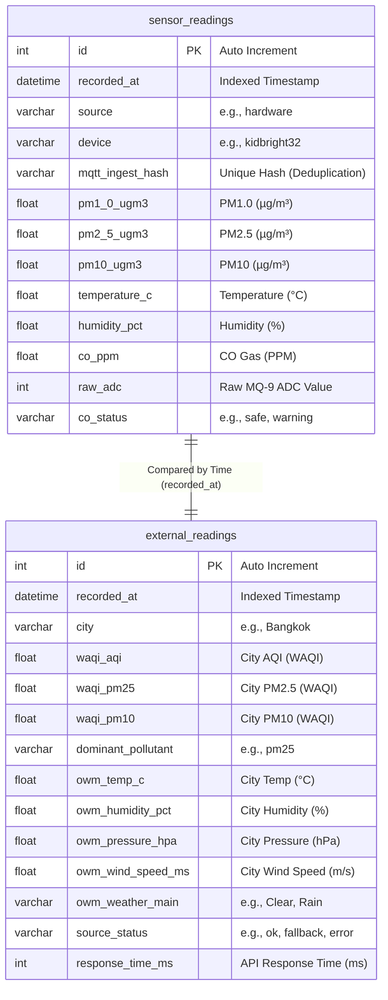
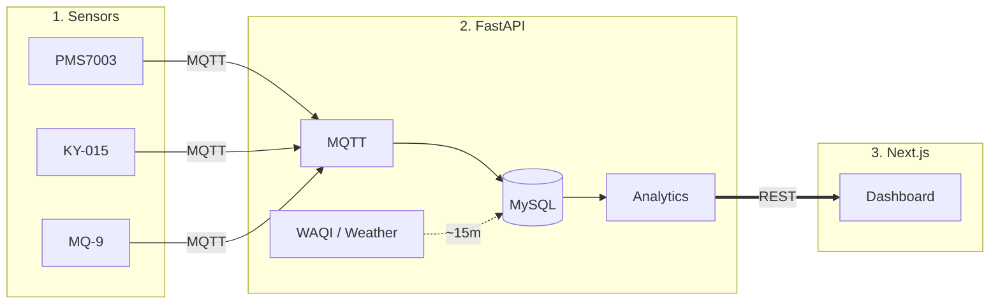

# Smart Air Quality Monitor

IoT air-quality stack: **KidBright32** sensors → **MQTT** → **FastAPI** + **MySQL** → external **WAQI / weather** APIs → **Next.js** dashboard (live data, comparisons, trends, alerts).

**Repository:** [github.com/smart-air-quality/smart-air-quality-system](https://github.com/smart-air-quality/smart-air-quality-system) · **License:** [MIT](LICENSE)

---

## Team

**Slides (Group 19, DAQ):** [Group19_Slides_DAQ.pdf](Group19_Slides_DAQ.pdf) — presentation PDF in the repository root.

| Photo | Name | Student ID | Affiliation |
| ----- | ---- | ---------- | ----------- |
| [t1.jpg](data/photos/t1.jpg) | Thapanan Suwansukhum | 6710545555 | Department of Computer Engineering, Faculty of Engineering, Kasetsart University |
| [c1.jpg](data/photos/c1.jpg) | Bhumipat Kusalatham | 6710545831 | Department of Computer Engineering, Faculty of Engineering, Kasetsart University |


---

## Overview

The backend stores sensor readings, merges **WAQI** and **weather** snapshots, runs **AQI**, **linear-regression trends** (6h window; the UI can extrapolate **+1h–+6h** from that slope), **alerts**, and an **awareness score**. The frontend polls the bundled **`/api/v1/dashboard`** endpoint.

---

## Features

- **Ingestion:** PM1.0 / PM2.5 / PM10, temperature, humidity, CO over MQTT.
- **Comparison:** Local vs city and sampled global cities (WAQI).
- **Analytics:** EPA-style local AQI, PM2.5 trend (+1h–+6h in UI), rule-based alerts, awareness score.
- **UI:** Next.js, Tailwind, Recharts; auto-refresh, historical charts with collapsible stats, tooltips, stale-sensor hint.

### Analysis (what it means)

- **Local AQI** — Converts your latest **PM2.5** into an **EPA-style** index and category so “how bad is it here?” is one number with a health band.
- **Comparison** — Pulls **city** AQI (WAQI) plus a **sample of global cities**, then shows **local vs city vs global average** and a **percentile** (“how many sampled cities are worse than you?”). The short **summary** text is generated from those numbers.
- **Trend** — Fits a **line to PM2.5 over the last ~6 hours**, labels it **improving / stable / worsening**, and draws a **straight-line forecast** for the next **1–6 hours** (not weather science—just “if the recent slope continued”).
- **Awareness score** — A **0–100** score that mixes **how severe** local AQI is with **how you rank** against the global sample, surfaced as a level (e.g. normal / elevated / critical).
- **Alerts** — Rule-based flags: e.g. **high PM2.5 or CO**, **local much worse than city or global baseline**, and **rapid PM2.5 rise** when the worsening trend is steep enough.

---

## Requirements


| Tool               | Notes                                                       |
| ------------------ | ----------------------------------------------------------- |
| **Python**         | **3.11** in Docker; **3.10+** for local venv.               |
| **Node.js**        | **20+** (Next.js 16).                                       |
| **npm**            | 10+ (with Node 20).                                         |
| **Docker Compose** | v3.8 file in repo root.                                     |
| **MySQL**          | **8.x** (e.g. KU `iot.cpe.ku.ac.th` or any reachable host). |


- **Backend deps:** [`backend/requirements.txt`](backend/requirements.txt) (FastAPI, Uvicorn, SQLAlchemy, PyMySQL, Paho-MQTT, Alembic, HTTPX, Pydantic v2, …).
- **Frontend deps:** [`frontend/package.json`](frontend/package.json) (Next 16.2.x, React 19.x, Tailwind 4.x, Recharts 3.x, TypeScript 5.x).
- **Device:** MicroPython on ESP32 / KidBright32 — [`iot/`](iot/).

---

## Quick Start

Use **Docker** (Option A) or **local** Python + Node (Option B). Create an empty MySQL **database** on the server first; credentials go in `.env` / `backend/.env`.

### Option A: Docker

1. **Clone & env**
  ```bash
   git clone https://github.com/smart-air-quality/smart-air-quality-system.git
   cd smart-air-quality-system
   cp .env.example .env          # macOS / Linux
   copy .env.example .env       # Windows CMD
  ```
   Edit `.env`: set `MYSQL_USER`, `MYSQL_PASSWORD`, `MYSQL_DATABASE` (and host if not default).
2. **Run**
  ```bash
   docker-compose up -d --build
  ```
3. **Tables** — On startup the backend calls SQLAlchemy **`create_all()`**, which usually creates tables on an **empty** schema. **Recommended:** run migrations so the DB matches `alembic/versions/`:
  ```bash
   docker-compose exec backend alembic upgrade head
  ```
4. **(Optional) Demo SQL** — Import [`data/export/collected_data.sql`](data/export/collected_data.sql) via [phpMyAdmin](https://iot.cpe.ku.ac.th/pma/) (Import → choose file → Go). See [`data/export/README.md`](data/export/README.md) if present.
5. **URLs** — App [http://localhost:3000](http://localhost:3000) · Swagger [http://localhost:8000/docs](http://localhost:8000/docs)

**Stop:** `docker-compose down` (add `-v` only if you intend to remove named volumes you added yourself).

### Option B: Without Docker

From repo root after clone:

```bash
cd backend
cp .env.example .env    # edit MYSQL_*, API keys
python3 -m venv venv && source venv/bin/activate   # Windows: venv\Scripts\activate
pip install -r requirements.txt
alembic upgrade head
uvicorn main:app --reload --host 0.0.0.0 --port 8000
```

Second terminal (repo root → `frontend/`):

```bash
cp .env.example .env.local   # set NEXT_PUBLIC_API_BASE_URL=http://localhost:8000 if needed
npm install && npm run dev
```

More: [`backend/README.md`](backend/README.md), [`frontend/README.md`](frontend/README.md).

---

## Hardware


| Part            | Role                   | Bus               |
| --------------- | ---------------------- | ----------------- |
| **KidBright32** | MCU (ESP32-class)      | WiFi / I²C / UART |
| **PMS7003**     | PM1 / PM2.5 / PM10     | UART              |
| **KY-015**      | Temperature & humidity | Digital           |
| **MQ-9**        | CO (and related gases) | Analog            |


---

## Trend logic (PM2.5 linear regression)

The backend fits a **straight line** to **local PM2.5** only (not other pollutants), over a sliding time window (default **6 hours**). It uses ordinary **least-squares regression**: time is expressed in **hours** from the first sample in the window, and the slope is **µg/m³ per hour** (`slope_per_hour`).

**Which points are used**

- Normally, only readings whose timestamps fall in the last *N* hours relative to **“now”** (UTC) are used—good for live MQTT data.
- If almost nothing falls in that window (e.g. old demo SQL), the code **falls back** to the last *N* hours relative to the **newest** row in the batch so a trend can still be shown.

**Labels (worsening / stable / improving)**

Classification is by comparing the fitted slope to configurable thresholds (defaults in `backend/app/core/config.py`: **`trend_slope_worsening` = +1.5**, **`trend_slope_improving` = −1.5**):


| Slope (µg/m³ per h) | Label     | Meaning (rough)                            |
| ------------------- | --------- | ------------------------------------------ |
| **> +1.5**          | Worsening | PM2.5 rising faster than the “stable” band |
| **< −1.5**          | Improving | PM2.5 falling faster than the stable band  |
| **in between**      | Stable    | Change within the dead band                |


If there are fewer than **two** valid PM2.5 points in the window, the API returns **`trend: "unknown"`** and omits useful predictions.

**Predictions (extrapolation only)**

The **latest PM2.5** in the window is treated as the intercept for a simple forward line: **predicted = max(0, last_pm25 + slope × hours_ahead)**. The dashboard lets you pick **+1 h** through **+6 h**; these are **not** weather or dispersion models—only the same linear slope extended in time. The UI notes that they are extrapolations.

**API**

- `GET /api/v1/trends?hours=6` (1–24) — same regression with an adjustable window; the bundled dashboard uses the default window in its trend block.

**Alerts (related)**

When the label is **worsening** and the slope exceeds **`trend_alert_min_slope`** (default **5.0** µg/m³/h), the alert pipeline can emit a rapid-increase style warning—see `backend/app/analysis/alerts.py`.

---

## Database schema

MySQL: **sensor** rows vs **external** snapshots; compared in time via `recorded_at` (logical alignment, not necessarily one FK).




---

## Architecture




---

## Tech stack

- **Edge:** KidBright32, MicroPython, PMS7003, KY-015, MQ-9
- **Backend:** Python, FastAPI, SQLAlchemy, PyMySQL, Paho-MQTT, Alembic
- **Frontend:** React, Next.js, Tailwind CSS, Recharts
- **Ops:** Docker Compose, MySQL 8

