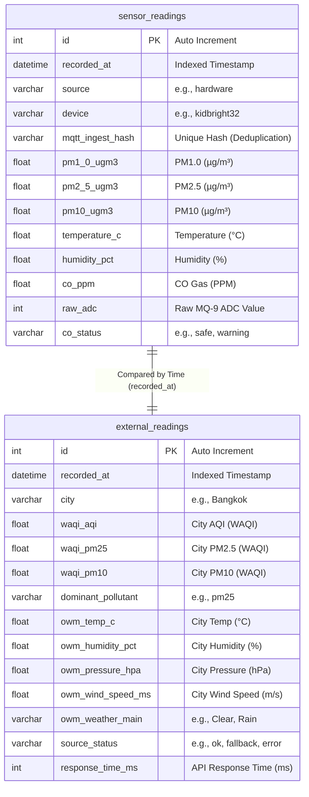
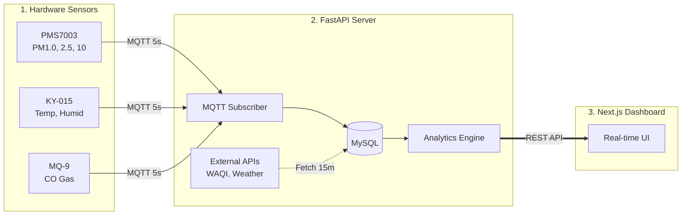

# Smart Air Quality Monitor

End-to-end IoT air-quality monitoring: sensors over MQTT, FastAPI + MySQL, external WAQI/weather data, analytics, and a Next.js dashboard.

---

## Project overview

The **Smart Air Quality Monitor** integrates a KidBright32-based sensor node (PM, temperature, humidity, CO), a Python **FastAPI** backend that persists readings to **MySQL** and pulls secondary data (WAQI, weather), and a **Next.js** dashboard for live and historical visualization, comparisons, trend extrapolation, alerts, and an awareness score.

---

## Team

| Name                 | Student ID | Affiliation (department, faculty, university)                                    |
| -------------------- | ---------- | -------------------------------------------------------------------------------- |
| Thapanan Suwansukhum | 6710545555 | Department of Computer Engineering, Faculty of Engineering, Kasetsart University |
| Bhumipat Kusalatham  | 6710545831 | Department of Computer Engineering, Faculty of Engineering, Kasetsart University |

---

## Features

- **Real-time IoT ingestion:** PM1.0, PM2.5, PM10, temperature, humidity, and CO via MQTT.
- **Global comparison:** Local readings vs city-level and sampled global cities (WAQI-backed).
- **Analytics:** US EPA–style local AQI, linear-regression trend (6h window), optional forecast horizons (+1h / +1 day / +3 days in the UI), intelligent alerts.
- **Dashboard:** Next.js + Tailwind + Recharts; auto-refresh, historical line charts with collapsible summaries, tooltips, stale-sensor warning.

---

## Requirements (libraries & tools)

Versions below match the **Dockerfile** / `package.json` / `requirements.txt` in this repo; slightly newer patch versions are usually fine.

| Tool                        | Version / notes                                                           |
| --------------------------- | ------------------------------------------------------------------------- |
| **Python**                  | **3.11** (backend Docker image); **3.10+** supported for local venv.      |
| **Node.js**                 | **20+** (for Next.js 16 frontend; LTS recommended).                       |
| **npm**                     | 10+ (ships with Node 20).                                                 |
| **Docker & Docker Compose** | For [Quick Start — Option A](#option-a-docker) (Compose file v3.8).       |
| **MySQL**                   | **8.x** (hosted e.g. on KU `iot.cpe.ku.ac.th` or any reachable instance). |

**Backend (pip):** see [`backend/requirements.txt`](backend/requirements.txt) — includes FastAPI 0.115.x, Uvicorn, SQLAlchemy 2.x, PyMySQL, Paho-MQTT, Alembic, HTTPX, Pydantic v2, etc.

**Frontend (npm):** see [`frontend/package.json`](frontend/package.json) — includes Next.js **16.2.x**, React **19.x**, Tailwind **4.x**, Recharts **3.x**, TypeScript **5.x**.

**IoT (device):** MicroPython on ESP32 / KidBright32; see [`iot/`](iot/) for drivers and config.

---

## Quick Start

**GitHub:** [https://github.com/smart-air-quality/smart-air-quality-system](https://github.com/smart-air-quality/smart-air-quality-system) — **License:** [MIT](LICENSE).

You can run everything with **Docker** (simplest, matches deployment) or run the **backend and frontend directly** on your machine (good for debugging and faster UI reloads). With the backend running, API docs are at `http://localhost:8000/docs`.

### Option A: Docker

This project is fully containerized and configured to connect to the KU database server (`iot.cpe.ku.ac.th`) out of the box to fulfill Requirement 1.2.

#### A.1. Setup environment

First, clone the repository and set up your database credentials:

```bash
git clone https://github.com/smart-air-quality/smart-air-quality-system.git
cd smart-air-quality-system

# Create your environment file (macOS/Linux)
cp .env.example .env

# Create your environment file (Windows Command Prompt)
copy .env.example .env
```

**Important:** Open the `.env` file and enter your KU database username, password, and database name.

#### A.2. Start services

```bash
docker-compose up -d --build
```

#### A.3. Initialize database (first run only)

Since the database is hosted on the KU server, you need to create the tables first:

```bash
docker-compose exec backend alembic upgrade head
```

_(Optional)_ To test the dashboard immediately without waiting for new hardware data, we have provided an exported dataset containing 3 days of real sensor readings.

**How to import the collected data:**

1. Go to **[https://iot.cpe.ku.ac.th/pma/](https://iot.cpe.ku.ac.th/pma/)** and log in.
2. Select your database from the left panel.
3. Click on the **Import** tab at the top.
4. Upload the file located at `data/export/collected_data.sql` from this repository.
5. Click **Go** to import the data.

#### A.4. Access the app

- **Web Dashboard:** [http://localhost:3000](http://localhost:3000)
- **API Swagger UI:** [http://localhost:8000/docs](http://localhost:8000/docs)

#### Stopping Docker services

```bash
docker-compose down
```

_(Add `-v` at the end if you want to completely wipe the database and start fresh)._

---

### Option B: Without Docker (local backend + frontend)

Use this when you prefer a local Python venv and `npm run dev`, or when Docker is not available.

**Prerequisites:** Python 3.10+ (3.11+ recommended), Node.js 20+, and a reachable MySQL database (KU host or local MySQL) with credentials ready.

#### B.1. Clone and backend environment

```bash
git clone https://github.com/smart-air-quality/smart-air-quality-system.git
cd smart-air-quality-system/backend

# macOS / Linux
cp .env.example .env

# Windows Command Prompt
copy .env.example .env
```

Edit `backend/.env`: set `MYSQL_*` (or `DATABASE_URL`), `WAQI_TOKEN`, `WEATHERAPI_KEY`, and optional `LOCATION_*` as needed. Demo API keys still work with fallback data.

#### B.2. Backend (virtualenv + migrations + server)

**macOS / Linux:**

```bash
python3 -m venv venv
source venv/bin/activate
pip install -r requirements.txt
alembic upgrade head
uvicorn main:app --reload --host 0.0.0.0 --port 8000
```

**Windows:**

```bash
python -m venv venv
venv\Scripts\activate
pip install -r requirements.txt
alembic upgrade head
uvicorn main:app --reload --host 0.0.0.0 --port 8000
```

- API: [http://localhost:8000](http://localhost:8000)
- Docs: [http://localhost:8000/docs](http://localhost:8000/docs)

Keep this terminal open. Optional seed data: import `data/export/collected_data.sql` via phpMyAdmin the same way as in Option A.

#### B.3. Frontend (second terminal)

In another terminal, go to the **repository root** (`smart-air-quality-system/`, i.e. the folder that contains `backend/` and `frontend/`). If you are still inside `backend/`, run `cd ..` first. Then:

```bash
cd frontend
cp .env.example .env.local
```

Ensure `NEXT_PUBLIC_API_BASE_URL` in `.env.local` points at your backend (default `http://localhost:8000`). Then:

```bash
npm install
npm run dev
```

- Dashboard: [http://localhost:3000](http://localhost:3000)

More detail for the API lives in [backend/README.md](backend/README.md); frontend env vars are described in [frontend/README.md](frontend/README.md).

---

## Hardware Components

| Component       | Function                                         | Interface         |
| --------------- | ------------------------------------------------ | ----------------- |
| **KidBright32** | Main Microcontroller (ESP32-based)               | WiFi / I2C / UART |
| **PMS7003**     | Measures Particulate Matter (PM1.0, PM2.5, PM10) | UART              |
| **KY-015**      | Measures Ambient Temperature & Humidity          | Digital Pin       |
| **MQ-9**        | Measures Carbon Monoxide (CO) Gas Concentration  | Analog Pin        |

---

## Trend Prediction Logic

The system uses **Linear Regression** on the last 6 hours of PM2.5 data to calculate the slope (rate of change per hour) and predict future air quality.

| Calculated Slope (µg/m³/hr) | Trend Status  | Prediction Logic (Next 1 Hour)                                      |
| --------------------------- | ------------- | ------------------------------------------------------------------- |
| **Slope > +1.5**            | **Worsening** | `Predicted = Current PM2.5 + Slope` (Air pollution is rising)       |
| **Slope < -1.5**            | **Improving** | `Predicted = Current PM2.5 + Slope` (Air quality is getting better) |
| **-1.5 ≤ Slope ≤ +1.5**     | **Stable**    | `Predicted ≈ Current PM2.5` (No significant changes expected)       |

---

## Database Schema (Data Integration)

**Integration diagram (ER):** primary **sensor** readings vs secondary **external** snapshots, aligned in time for comparison on the dashboard. The system uses MySQL; rows are joined logically by `recorded_at` (and by query windows in the API), not necessarily by a single SQL foreign key.



---

## Architecture & Data Flow



---

## Tech Stack

- **IoT:** KidBright32, PMS7003, KY-015, MQ-9
- **Backend:** Python, FastAPI, SQLAlchemy, PyMySQL, Paho-MQTT
- **Frontend:** React, Next.js, Tailwind CSS, Recharts
- **Infrastructure:** Docker, MySQL 8
