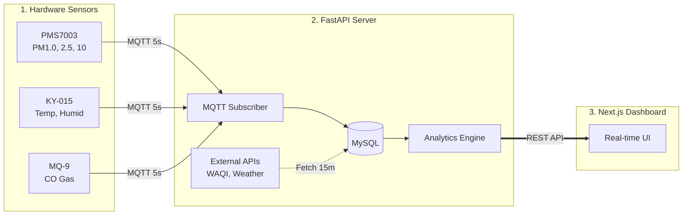

# 🍃 Smart Air Quality Monitor

An end-to-end IoT system for monitoring and analyzing air quality. This project collects hardware sensor data via MQTT, fetches global weather APIs, analyzes trends, and visualizes everything on a real-time dashboard.

---

## Key Features

- **Real-time IoT Ingestion:** Collects PM1.0, PM2.5, PM10, Temperature, Humidity, and CO gas levels via MQTT.
- **Global Comparison:** Compares local air quality against city averages and 10 major global cities.
- **Smart Analytics:** Calculates US EPA AQI, predicts 1-hour PM2.5 trends using linear regression, and generates health alerts.
- **Modern Dashboard:** A responsive Next.js web app with live updates and historical charts.

---

## Hardware Components

| Component       | Function                                         | Interface         |
| --------------- | ------------------------------------------------ | ----------------- |
| **KidBright32** | Main Microcontroller (ESP32-based)               | WiFi / I2C / UART |
| **PMS7003**     | Measures Particulate Matter (PM1.0, PM2.5, PM10) | UART              |
| **KY-015**      | Measures Ambient Temperature & Humidity          | Digital Pin       |
| **MQ-9**        | Measures Carbon Monoxide (CO) Gas Concentration  | Analog Pin        |

---

## Trend Prediction Logic

The system uses **Linear Regression** on the last 6 hours of PM2.5 data to calculate the slope (rate of change per hour) and predict future air quality.

| Calculated Slope (µg/m³/hr) | Trend Status  | Prediction Logic (Next 1 Hour)                                      |
| --------------------------- | ------------- | ------------------------------------------------------------------- |
| **Slope > +1.5**            | **Worsening** | `Predicted = Current PM2.5 + Slope` (Air pollution is rising)       |
| **Slope < -1.5**            | **Improving** | `Predicted = Current PM2.5 + Slope` (Air quality is getting better) |
| **-1.5 ≤ Slope ≤ +1.5**     | **Stable**    | `Predicted ≈ Current PM2.5` (No significant changes expected)       |

---

## Architecture & Data Flow



---

## Quick Start (Docker)

This project is fully containerized and configured to connect to the KU database server (`iot.cpe.ku.ac.th`) out of the box to fulfill Requirement 1.2.

### 1. Setup Environment

First, clone the repository and set up your database credentials:

```bash
git clone https://github.com/smart-air-quality/smart-air-quality-system.git
cd smart-air-quality-system

# Create your environment file
cp .env.example .env
```

**Important:** Open the `.env` file and enter your KU database username, password, and database name.

### 2. Start Services

Run the following command to start the Backend and Frontend:

```bash
docker-compose up -d --build
```

### 3. Initialize Database (First Run Only)

Since the database is hosted on the KU server, you need to create the tables first:

```bash
docker-compose exec backend alembic upgrade head
```

_(Optional)_ If you want to populate your KU database with 3 days of realistic mock data for presentation:

```bash
# 1. Generate the SQL file
python3 generate_mock_data.py > mock_data.sql

# 2. Import it to the KU server using phpMyAdmin
# Go to: https://iot.cpe.ku.ac.th/pma/ -> Select your DB -> Import -> Upload mock_data.sql
```

### 4. Access the App

- **Web Dashboard:** [http://localhost:3000](http://localhost:3000)
- **API Swagger UI:** [http://localhost:8000/docs](http://localhost:8000/docs)

---

## Stopping Services

To stop the application, run:

```bash
docker-compose down
```

_(Add `-v` at the end if you want to completely wipe the database and start fresh)._

---

## Tech Stack

- **IoT:** KidBright32, PMS7003, KY-015, MQ-9
- **Backend:** Python, FastAPI, SQLAlchemy, PyMySQL, Paho-MQTT
- **Frontend:** React, Next.js, Tailwind CSS, Recharts
- **Infrastructure:** Docker, MySQL 8
